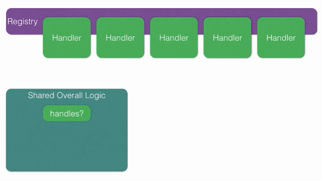

# HandlerRegisterable

## Description

Registered handlers allow common code to collaborate with a handler which is designed to meet a more concrete requirement.

The basic premise is that a registry is created for a particular concern, and this registry allows each specific handler to be added. The registry handlers will conform to a documented API, and may often provide a base class or default implementations.

Your application and context specific details can be written in a specific handler, and then added to the registry. At run time, code that needs to collaborate with the appropriate handler from the registry is correctly given the appropriate handler.



## Installation

Add to your project's Gemfile:

```ruby
gem 'handler_registerable'
```

Run in your project root:

```
bundle install
```

## Usage

This gem provides a Ruby module which can be extended into a class/module to provide the following class methods:

`registered_handlers` - returns a hash which can be modified
`obtain` - loops through all registered handlers and returns the first one that handles the given condition (tested by calling the `handles?` class method on each handler)

### Creating your registry

A registry is usually a module within a given namespace. For example let's create a welcome handler:

```ruby
module WelcomeHandlers
end
```

```ruby
module WelcomeHandlers
  extend HandlerRegisterable::Registry
end
```

### Base classes and registering

To make life easier you can provide a base class which allows users to subclass and register themselves within the registry:

```ruby
module WelcomeHandlers
  class Base
    def initialize(context)
      @context = context
    end

    # Registers a handler with the given identifier.
    #
    # @param [Symbol] handler the identifier to represent this handler class.
    def self.register(handler)
      WelcomeHandlers.register self, handler
    end
  end
end
```

It's important to document the public API which handlers are required to implement. These methods will be dependant on the purpose of the registry, but all will require the appropriate `handles?` API for that registry.

```ruby
module WelcomeHandlers
  class Example < Base
    register :first_time_user

    def handles?(context)
      context.some_attribute == 'example'
    end
  end
end
```

> Note: Handlers don't necessarily need to be within the registry's namespace (in fact in application code it will be in your own namespaces).

The exact arguments and conditions for the `handles?` class method in the handlers is specific to the purpose of the registry. This should always be a single arg, but if you need more than one, you can use a hash. However, you should look to keep the details to a minimum.

### Defining and Registering

Let's now define the public API for our Welcome handlers

* `welcome_message` - returns the string for this type of business
* `expiry_reminders` - array of time periods from trial expiration to email reminders

Here's a couple of example handlers:

```ruby
class ProductOneWelcome < WelcomeHandler::Base
  register :product_one

  def self.handles(user)
    user.product = 'product_one'
  end

  def welcome_message
    'Thanks for choosing product one'
  end

  def expiry_reminders
    [2.weeks, 1.week, 2.days]
  end
end

class ProductTwoeWelcome < WelcomeHandler::Base
  register :product_two

  def self.handles(user)
    user.product = 'product_two'
  end

  def welcome_message
    'Thanks for choosing product two'
  end

  def expiry_reminders
    [1.week, 2.days, 1.day]
  end
end
```

### Setting a Default

When no handler is found, it is possible to specify a default handler to use instead:

```ruby
module WelcomeHandlers
  class Default < Base
    WelcomeHandlers.default = self

    def welcome_message
      'A default welcome message'
    end
  end
end
```

### Using the registry

The way the registry is used is through the `obtain` method:

```ruby
# code in a signup to a service object

def complete_signup(user)
  welcome = WelcomeHandlers.obtain(user)
  user.send_message(welcome.welcome_message)
  ReminderJob.schedule_for_user(user, welcome.expiry_reminders)
end
```

# License

Copyright (c) 2016 Sage

[Apache-2.0 License](https://github.com/Sage/handler_registerable/blob/master/LICENSE)
